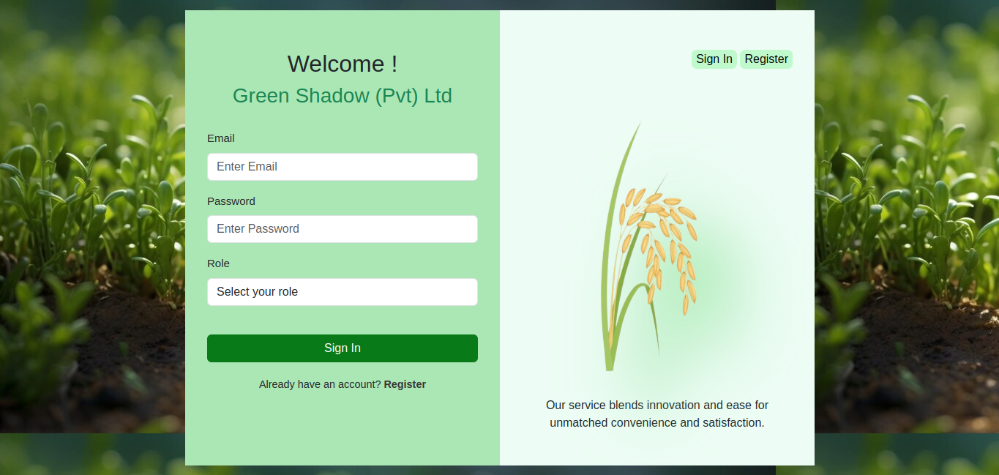
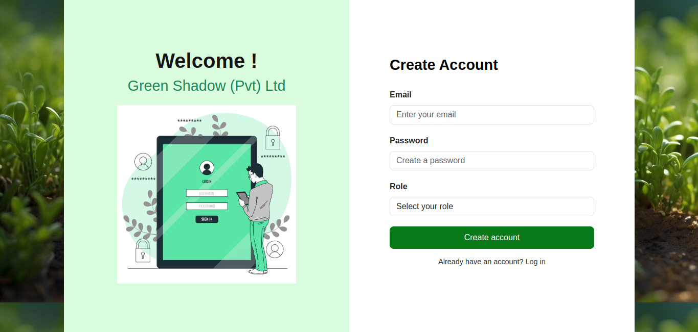
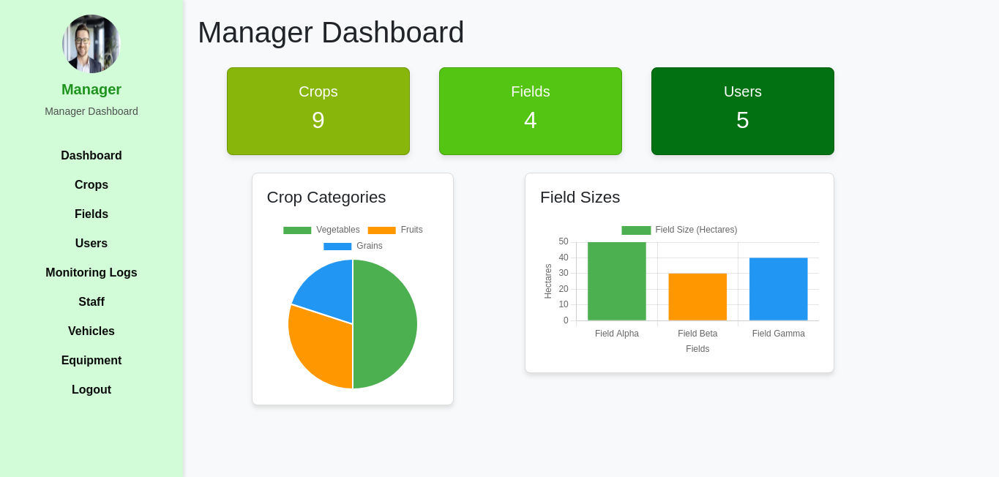
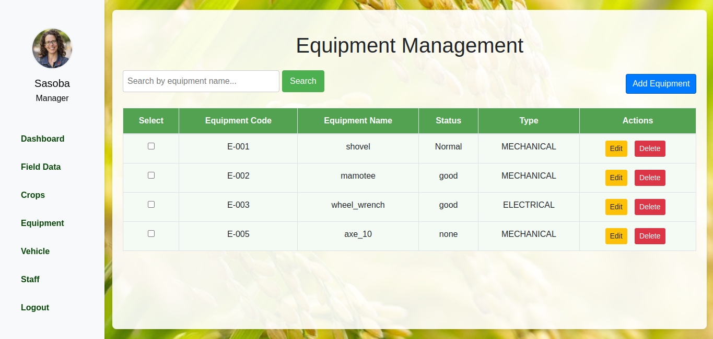
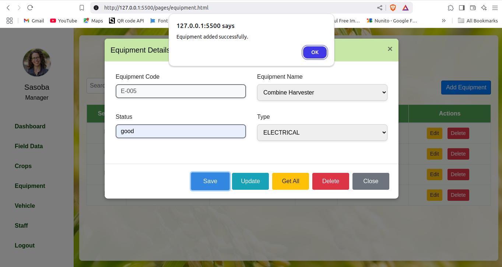
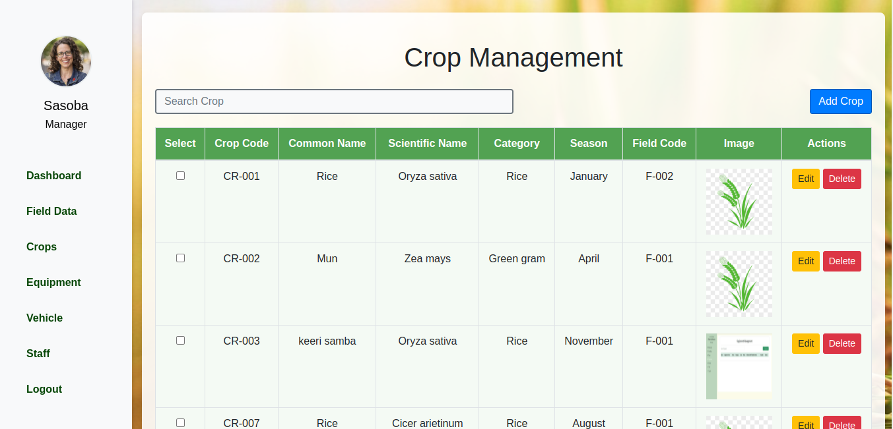

<h1 align="center">
    
</h1>

### Description
This is a backend implementation of a Crop Monitoring Management System using the Spring Framework and other Java-based technologies. The API provides endpoints to manage crops, fields, equipment, staff, vehicles, and monitoring logs. The project is built using Spring Boot for RESTful services, Hibernate for database interaction, and MySQL as the database. Lombok is used to reduce boilerplate code

### Technologies Used

- Spring Framework (Web MVC): Backend framework for building RESTFULL services.
- Hibernate: ORM (Object Relational Mapping) for database interaction.
- Spring Data JPA: Data repository abstraction layer for database operations.
- MySQL: Relational database used for storing POS data.
- Lombok: Used to reduce boilerplate code (getters/setters, constructors) and implement logging using SLF4J.
- SLF4J: Simple Logging Facade for Java used for logging and debugging purposes.

### API Endpoints

#### Field Management
- *GET* /fields          : Get all fields.
- *GET* /fields/{id}     : Get a field by ID.
- *POST* /fields         : Add a new field.
- *PATCH* /fields/{id}     : Update a field by ID.
- *DELETE* /fields/{id}  : Delete a field by ID.

#### Crop Management
- *GET* /crops           : Get all crops.
- *GET* /crops/{id}      : Get a crop by ID.
- *POST* /crops          : Add a new crop.
- *PATCH* /crops/{id}      : Update a crop by ID.
- *DELETE* /crops/{id}   : Delete a crop by ID.

#### Staff Management
- *GET* /staff           : Get all staff.
- *GET* /staff/{id}      : Get a staff member by ID.
- *POST* /staff          : Add a new staff member.
- *PATCH* /staff/{id}      : Update a staff member by ID.
- *DELETE* /staff/{id}   : Delete a staff member by ID.

#### Monitoring Log Management
- *GET* /monitoring-logs          : Get all monitoring logs.
- *GET* /monitoring-logs/{id}     : Get a monitoring log by ID.
- *POST* /monitoring-logs         : Add a new monitoring log.
- *PATCH* /monitoring-logs/{id}     : Update a monitoring log by ID.
- *DELETE* /monitoring-logs/{id}  : Delete a monitoring log by ID.

#### Vehicle Management
- *GET* /vehicles         : Get all vehicles.
- *GET* /vehicles/{id}    : Get a vehicle by ID.
- *POST* /vehicles        : Add a new vehicle.
- *PATCH* /vehicles/{id}    : Update a vehicle by ID.
- *DELETE* /vehicles/{id} : Delete a vehicle by ID.

#### Equipment Management
- *GET* /equipment         : Get all equipment.
- *GET* /equipment/{id}    : Get equipment by ID.
- *POST* /equipment        : Add new equipment.
- *PATCH* /equipment/{id}    : Update equipment by ID.
- *DELETE* /equipment/{id} : Delete equipment by ID.

### API Documentation

You can view the detailed API documentation with example requests and responses [here](https://documenter.getpostman.com/view/35386302/2sAYBa8pJR).

### Clone Repository
<ul>
  <li>Clone the repository:
     git clone https://github.com/sasobapriyanjana11/Crop-Monitoring-System.git
  </li>
  <li>Configure the Database:
     Set up your MySQL database.
  </li>
  <li>Update Hibernate Configuration:
     Update and configure the Hibernate settings for MySQL. Ensure the correct JDBC URL, username, and password are set for your MySQL database.
  </li>
  <li>Update Logger Configuration:
     Update the logger configuration for the application in logback.xml.
  </li>
  <li>Build & Deploy:
     Build the project using Maven.
     Run the Spring application.
  </li>
</ul>

## Screenshots

  

    <h3>SignIn Page</h3>
    
  

  

    <h3>Signup Page</h3>
    
  

  

    <h3>Manager Dashboard Page</h3>
    
  

  

    <h3>Equipment Page</h3>
    
  

  

    <h3>Add Equipment Page</h3>
    
  

 

    <h3>Crop Management Page</h3>
    
  

### License

This project is licensed under the [MIT License](LICENSE) - see the LICENSE file for details.
